<!-- ═══════════════════════════ HERO BANNER ═══════════════════════════ -->

📍 Bengaluru, Karnataka, India &nbsp;·&nbsp;
💻 Software Engineer &nbsp;·&nbsp;
🎓 Computer Science Engineering Graduate

<!-- ═══════════════════════════ NAVIGATION ═══════════════════════════ -->

<!-- ═══════════════════════════ ABOUT ═══════════════════════════ -->

<h3 align="center">👨‍💻 About Me</h3>

<table width="100%">
<tr>
<td>

I'm an Associate Software Engineer with hands-on experience building and
maintaining production-ready ERP and full-stack applications.

I primarily work with Java, Spring Boot, React.js, Next.js, Node.js,
PostgreSQL, MySQL, MongoDB, and Redis. My experience includes building
secure REST APIs, authentication and authorization systems, RBAC,
microservices, data migration services, notification systems, biometric
attendance integrations, and GPS-based vehicle tracking.

I enjoy solving real-world engineering problems and building software that
is secure, reliable, maintainable, and scalable.

</td>
</tr>
</table>

<!-- ═══════════════════════════ WHAT I DO ═══════════════════════════ -->

<h3 align="center">🚀 What I Do</h3>

<table width="100%">
<tr>
<td>

- 💻 Build backend and full-stack applications using Java, Spring Boot, Node.js, React.js, and Next.js
- 🔐 Design authentication, authorization, RBAC, and secure API workflows
- 🔌 Develop REST APIs and integrate external services and systems
- 🗄️ Work with PostgreSQL, MySQL, MongoDB, and Redis
- 📩 Build Email, SMS, and WhatsApp notification workflows
- 📊 Develop data migration services with validation and structured processing
- 🧑‍💻 Build biometric attendance integrations with device synchronization
- 🚌 Implement GPS-based school bus tracking using Traccar
- ⚙️ Work with microservices, Docker, Kubernetes, and API integrations
- 🧩 Practice Data Structures & Algorithms and problem solving
- 🏗️ Apply Object-Oriented Programming and System Design concepts

</td>
</tr>
</table>

<!-- ═══════════════════════════ TECH STACK ═══════════════════════════ -->

<h3 align="center">🛠️ Tech Stack</h3>

<table width="100%">
<tr>
<td>

#### 💻 Languages

</td>
</tr>
<tr>
<td>

#### ⚙️ Backend

  

**Backend Areas:**  
REST API Development · Authentication · Authorization · RBAC ·
API Security · Microservices · API Design · Database Integration

</td>
</tr>
<tr>
<td>

#### 🎨 Frontend

</td>
</tr>
<tr>
<td>

#### 🗄️ Databases

</td>
</tr>
<tr>
<td>

#### 🔐 Security

  

**Security:**  
JWT Authentication · Authentication · Authorization · RBAC ·
HTTP Cookies · API Security

</td>
</tr>
<tr>
<td>

#### ☁️ Tools & DevOps

  

**Tools:**  
Git · GitHub · Docker · Kubernetes · Postman · CI/CD

</td>
</tr>
</table>

<!-- ═══════════════════════════ CORE CONCEPTS ═══════════════════════════ -->

<h3 align="center">🧠 Core Concepts</h3>

<!-- ═══════════════════════════ EXPERIENCE ═══════════════════════════ -->

<h3 align="center">💼 Experience</h3>

<table width="100%">
<tr>
<td>

#### Associate Software Engineer — SkyllX Technologies Pvt. Ltd.
**June 2026 – Present**

Working as a Java Full Stack Developer on production ERP applications.

- 💻 Develop and maintain production ERP applications using Java, Spring Boot,
  Next.js, React.js, PostgreSQL, MySQL, and microservices architecture.
- 🔐 Design and develop secure REST APIs using Spring Boot and Spring Data JPA.
- 🛡️ Implement authentication, authorization, and RBAC across student,
  staff, administrator, and organizational roles.
- 📩 Build Email, WhatsApp, and SMS notification workflows including
  MSG91 integration and DLT template mapping.
- 📊 Develop Excel-based bulk data migration services with validation,
  structured processing, and error handling.
- 🔄 Implement student and staff transfer workflows between institutes
  within the same organization.
- 🧑‍💻 Implement biometric attendance integrations including device
  enrollment, queued synchronization, device communication, and
  automatic attendance processing.
- 🚌 Integrate Traccar-based GPS vehicle tracking using vehicle IMEI
  registration and real-time GPS data to display bus location, speed,
  and movement status.
- 🗄️ Work with PostgreSQL and MySQL for database queries, application
  data management, production workflows, and migrations.

</td>
</tr>
</table>

 

<table width="100%">
<tr>
<td>

#### 🏥 BAMS ERP

Production ERP platform for Ayurvedic institutions.

- 🔐 Implemented centralized authentication, authorization, and RBAC
  for students, principals, teachers, staff, and administrative users.
- 📩 Designed and implemented centralized Email, SMS, and WhatsApp
  notification workflows.
- 🧑‍💻 Implemented biometric attendance for daily and period-wise
  attendance.
- 🔄 Developed backend APIs and integration workflows for
  multi-device biometric attendance synchronization.

</td>
</tr>
</table>

 

<table width="100%">
<tr>
<td>

#### 🔧 Backend Developer — Topmai

Worked on backend development using the MERN stack.

- 💻 Developed backend services using Node.js, Express.js, MongoDB,
  and PostgreSQL.
- 🔌 Designed and developed REST APIs for application modules,
  data management, authentication, and authorization.
- 🔐 Implemented Role-Based Access Control for role-specific permissions.
- 🛡️ Strengthened backend security through authentication,
  authorization, protected API routes, and access-control mechanisms.
- ⚡ Developed real-time communication modules using Socket.IO.

</td>
</tr>
</table>

<!-- ═══════════════════════════ PROJECTS ═══════════════════════════ -->

<h3 align="center">🚀 Featured Projects</h3>

<table width="100%">
<tr>
<td>

#### 🎓 HR Portal

  

- Built a full-stack platform for managing placement drives,
  student applications, recruiter workflows, and candidate tracking.
- Implemented JWT-based authentication and RBAC for administrators,
  recruiters, and students.
- Developed search, filtering, candidate management, and application
  tracking workflows.
- Integrated Redis for session management and caching.

</td>
</tr>
</table>

 

<table width="100%">
<tr>
<td>

#### 🗳️ Online Voting Application

  

- Built a secure online voting platform using PostgreSQL,
  Express.js, React.js, and Node.js.
- Implemented role-based authentication and secure vote storage.
- Developed real-time vote counting and interactive result dashboards.
- Designed APIs for voter management, election configuration,
  voting workflows, and result processing.

</td>
</tr>
</table>

<!-- ═══════════════════════════ INTEGRATIONS ═══════════════════════════ -->

<h3 align="center">🧩 Integrations & Systems</h3>

<table width="100%">
<tr>
<td>

#### 🚌 GPS Vehicle Tracking

  

Implemented GPS-based school bus tracking by integrating vehicle
registration through IMEI and processing real-time location data to
display bus location, speed, and movement status through map-based
interfaces.

</td>
</tr>
</table>

 

<table width="100%">
<tr>
<td>

#### 📱 Notification Systems

  

Designed and implemented notification workflows supporting multiple
communication channels with template management, DLT mapping,
delivery workflows, and external service integrations.

</td>
</tr>
</table>

 

<table width="100%">
<tr>
<td>

#### 🧑‍💻 Biometric Attendance

Implemented biometric attendance integrations involving device
enrollment, synchronization, queued processing, device communication,
and automatic attendance marking for students and staff.

</td>
</tr>
</table>

<!-- ═══════════════════════════ DSA ═══════════════════════════ -->

<h3 align="center">🧠 Data Structures & Algorithms</h3>

<table width="100%">
<tr>
<td>

I regularly practice problem-solving and focus on building strong
computer science fundamentals.

**Topics:**

</td>
</tr>
</table>

<!-- ═══════════════════════════ CERTIFICATION ═══════════════════════════ -->

<h3 align="center">📜 Certification</h3>

<table width="100%">
<tr>
<td align="center">

🏅 **Software Engineer Certificate — HackerRank**

</td>
</tr>
</table>

<!-- ═══════════════════════════ GITHUB STATS ═══════════════════════════ -->

<h3 align="center">📊 GitHub Stats</h3>

<!-- ═══════════════════════════ FOCUS ═══════════════════════════ -->

<h3 align="center">🌱 Currently Focused On</h3>

<table width="100%">
<tr>
<td>

- ☕ Advanced Java & Spring Boot
- 🧩 Data Structures & Algorithms
- 🏗️ System Design
- 🔐 Backend Security & API Design
- 🗄️ Database Design & Performance
- ⚙️ Scalable Backend Architecture
- 🚀 Production Software Engineering

</td>
</tr>
</table>

<!-- ═══════════════════════════ CAREER INTERESTS ═══════════════════════════ -->

<h3 align="center">🎯 Career Interests</h3>

<table width="100%">
<tr>
<td align="center">

💻 Software Engineering ·  
☕ Java Backend Development ·  
⚙️ Spring Boot ·  
🌐 Full Stack Development ·  
🔧 Backend Engineering ·  
🏗️ System Design ·  
☁️ Cloud & DevOps

</td>
</tr>
</table>

<!-- ═══════════════════════════ CONNECT ═══════════════════════════ -->

<h3 align="center">📫 Connect With Me</h3>

 

<!-- ═══════════════════════════ FOOTER BANNER ═══════════════════════════ -->

